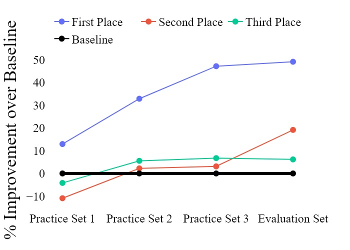
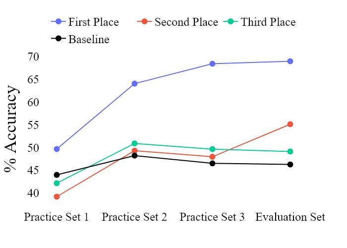

# Ship Track Construction: ATD 2025 Challenge 🏆 2nd Place

[](https://gitlab.com/algorithms-for-threat-detection/2025)
[](https://gitlab.com/algorithms-for-threat-detection/2025)
[](results/)
[](https://www.python.org)
[](https://pytorch.org)

## Overview

This repository contains the 2nd place solution for the [Algorithms for Threat Detection (ATD) 2025 Challenge](https://gitlab.com/algorithms-for-threat-detection/2025), organized by Penn State's Applied Research Lab (ARL) and sponsored by the National Geospatial-Intelligence Agency (NGA).

**Team:** University of Central Florida (UCF)
**Placement:** 2nd out of all competing teams
**Final Performance:** 19.3% improvement over baseline algorithm

## Problem Statement

The ATD 2025 Challenge addresses a critical problem in maritime domain awareness: **constructing ship tracks from anonymized, real-world observations**. Given individual observations containing:
- Ship position (latitude/longitude)
- Velocity vectors
- Timestamps
- **No ship identity information**

The objective is to reconstruct complete ship trajectories by associating observations that belong to the same vessel. This is a complex multi-target tracking problem with direct applications in national security, maritime surveillance, and data science.

## Results

Our team demonstrated consistent improvement throughout the competition, ultimately outperforming the official baseline by nearly 20% on the final evaluation set.

### Performance Progression

<p align="center">
  
</p>

**Key Achievements:**
- Started at -10% below baseline (Practice Set 1)
- Improved to +19.3% above baseline (Evaluation Set)
- Maintained 2nd place position with consistent performance gains

### Accuracy Across Datasets

<p align="center">
  
</p>

**Final Evaluation Performance:**
- **Our Team (2nd Place):** 55.1% accuracy
- **Baseline:** 46.4% accuracy
- **Improvement:** +18.8 percentage points

## Methodology

Our solution combines multiple algorithmic approaches to achieve robust ship track construction:

### 1. **Kalman Filter Implementations**
Custom PyTorch implementations for GPU-accelerated filtering:
- **Constant Velocity Model** (`kalman_const_velocity.ipynb`)
- **Constant Turn Rate Model** (`kalman_const_turn.ipynb`)
- **Adaptive Half-Maneuver Model** (`kalman_half_maneuver.ipynb`)

### 2. **Coverage-Based Track Refinement (CBTR)**
Distance-based clustering with ellipsoidal gating for track association:
- Custom distance matrix computation (`cbtr_closest/`)
- Memory-optimized implementation for large-scale data
- Ellipsoidal gating for improved association accuracy

### 3. **Deep Learning Hybrid Model**
Supervised classification approach using historical AIS data:
- 17-class ship behavior classification
- Multi-day temporal feature engineering
- PyTorch-based training pipeline (`deep_class20_folder.py`)

### 4. **Ensemble Clustering**
Multiple unsupervised clustering algorithms:
- Distance matrix clustering (`dist_matrix_clustering.ipynb`)
- DBSCAN, hierarchical clustering variants
- Comparative analysis of clustering strategies

### 5. **Oracle Analysis**
Theoretical upper-bound analysis for algorithm performance:
- Screen size optimization (`oracle_analysis.ipynb`)
- Performance ceiling estimation

## Repository Structure

```
.
├── README.md                          # This file
├── requirements.txt                   # Python dependencies
│
├── results/                           # Competition results and visualizations
│   ├── results_accuracy.png          # Accuracy comparison chart
│   └── results_improvement.jpg       # Improvement progression chart
│
├── ucf_atd_model/                     # Core helper functions and utilities
│   ├── baseline.py                   # ATD2025 baseline implementation
│   ├── data.py                       # Data loading and preprocessing
│   ├── c20_consts.py                 # Constants for 20-class dataset
│   └── datasets/                     # Dataset utilities and loaders
│       ├── create_link_data.py       # Link data generation
│       ├── create_20class_data.py    # Classification dataset creation
│       ├── pt_datasets.py            # PyTorch dataset classes
│       └── utils.py                  # Dataset helper functions
│
├── Kalman Filter Notebooks
│   ├── kalman_const_velocity.ipynb   # Constant velocity Kalman filter
│   ├── kalman_const_turn.ipynb       # Constant turn rate Kalman filter
│   └── kalman_half_maneuver.ipynb    # Adaptive half-maneuver Kalman filter
│
├── Deep Learning Pipeline
│   ├── create_20class_dataset.py     # Multi-process dataset generation
│   ├── collate_20class_dataset.py    # Dataset collation across days
│   ├── deep_class20_folder.py        # Model training script
│   └── deep_model_eval.ipynb         # Model evaluation notebook
│
├── CBTR Algorithm
│   ├── cbtr_closest/                 # CBTR distance computation
│   │   ├── cbtr_dist_matrix_maker.ipynb
│   │   ├── closest_ds1.npy           # Precomputed nearest neighbors
│   │   └── closest_dists_ds1.npy     # Precomputed distances
│   └── dist_matrix_clustering.ipynb  # Clustering on distance matrices
│
├── Oracle Analysis
│   ├── oracle.ipynb                  # Oracle generation for various k
│   ├── oracle_analysis.ipynb         # Oracle performance analysis
│   └── oracle_out/                   # Oracle outputs (k=2 to k=5000)
│
├── Model Outputs
│   ├── checkpoints/                  # Trained model checkpoints
│   │   └── epoch_180.pt              # Final model weights
│   ├── clustering_output/            # Clustering algorithm outputs
│   ├── ml_out_ds1.csv                # Hybrid model predictions
│   ├── xmean.pt                      # Feature normalization (mean)
│   └── xstd.pt                       # Feature normalization (std)
│
└── docs/                             # Additional documentation
```

## Installation

### Prerequisites
- Python 3.8+
- CUDA-capable GPU (recommended for Kalman filters and deep learning)
- Git

### Setup

1. **Clone the repository**
```bash
git clone <repository-url>
cd ucf_atd2025-export_book
```

2. **Install dependencies**
```bash
pip install -r requirements.txt
```

3. **Install ATD2025 evaluation package**
```bash
pip install git+https://gitlab.com/algorithms-for-threat-detection/2025/atd2025.git
```

4. **Download historical AIS data (optional, for training)**
```bash
# Download preprocessed AIS dataset from:
# https://figshare.com/articles/dataset/Preprocessed_AIS_Dataset/29975875
# Place in: ucf_atd_model/datasets/
```

## Usage

### Running Kalman Filters
```bash
jupyter notebook kalman_const_velocity.ipynb
```

### Training the Hybrid Model
```bash
# Generate 20-class dataset
python create_20class_dataset.py

# Train the model
python deep_class20_folder.py
```

### Running CBTR Clustering
```bash
jupyter notebook dist_matrix_clustering.ipynb
```

### Evaluating Results
```bash
# Requires ATD2025 package
jupyter notebook deep_model_eval.ipynb
```

## Technical Details

### Key Technologies
- **PyTorch:** Deep learning framework for hybrid model and GPU-accelerated Kalman filters
- **NumPy/SciPy:** Numerical computing and optimization
- **Pandas:** Data manipulation and analysis
- **GeoPandas:** Geospatial data processing
- **Scikit-learn:** Clustering algorithms and machine learning utilities
- **Optuna:** Hyperparameter optimization

### Computational Requirements
- **GPU Memory:** 16GB+ recommended for training
- **RAM:** 32GB+ for distance matrix computation
- **Storage:** ~50GB for historical AIS dataset
- **Parallel Processing:** Multi-core CPU for dataset generation

## Team

**University of Central Florida (UCF)**
- Department of Statistics and Data Science
- Institute for Simulation and Training (IST)

## Acknowledgments

- **Penn State Applied Research Lab (ARL)** for organizing the competition
- **National Geospatial-Intelligence Agency (NGA)** for sponsorship
- **ATD2025 Competition Organizers** for providing the challenge framework and evaluation tools

## Competition Context

The Algorithms for Threat Detection Challenge is an annual national competition focusing on developing advanced algorithms for maritime domain awareness and national security applications. The 2025 challenge specifically addressed the ship track construction problem using real-world, anonymized maritime observation data.

**Competition Website:** https://gitlab.com/algorithms-for-threat-detection/2025
**Evaluation Package:** https://gitlab.com/algorithms-for-threat-detection/2025/atd2025

## Citation

If you use this work in your research, please cite:

```bibtex
@misc{ucf_atd2025,
  title={Ship Track Construction: 2nd Place Solution for ATD 2025 Challenge},
  author={Bulent Soykan and UCF Team},
  year={2025},
  howpublished={University of Central Florida},
  note={2nd Place, Algorithms for Threat Detection 2025 Challenge}
}
```

## License

MIT License - See [LICENSE](LICENSE) file for details.

---

**Contact:** University of Central Florida
**Competition Year:** 2025
**Achievement:** 🏆 2nd Place National Placement
